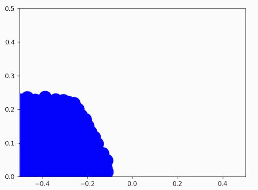

# **Python Fluid Simulation**


A Python 2D fluid simulation using SPH

<p align="center">
  
</p>

Implementing smoothed particle hydrodynamics (SPH) in Python using this <a href="https://web.archive.org/web/20090722233436/http://blog.brandonpelfrey.com/?p=303" target="_blank">tutorial</a>.

See also the C# implementation in Unity <a href="https://github.com/AlexandreSajus/Unity-Fluid-Simulation" target="_blank">here</a>.

## **Installation**

Make sure you have Python installed on your computer. Then, in a terminal, run the following commands:

**1. Install the package with pip in your terminal:**

```bash
pip install git+https://github.com/AlexandreSajus/Python-Fluid-Simulation.git
```

**2. Run the simulation:**

```bash
python -m pythonsph
```

This will prompt a matplotlib animation window with a real-time simulation:

<p align="center">
  
</p>
